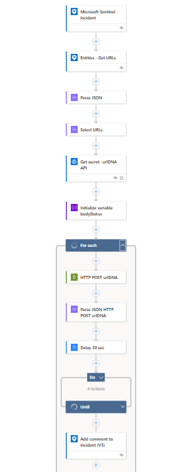
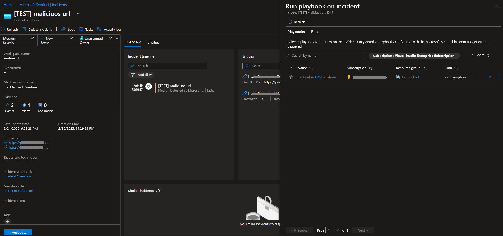
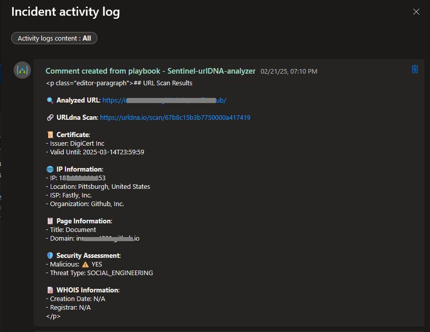

# Microsoft Sentinel Playbook for urlDNA
## Author

**Antonio Formato**  
  
  

## Overview
This playbook (Azure Logic App)is designed to automate the process of scanning URLs found in Microsoft Sentinel incidents. It follows these steps:

1. Extracts URL entities from a Sentinel incident.
2. Calls the urlDNA API to analyze the extracted URLs.
3. Formats the results and adds them as a comment to the incident.

## Playbook Versions
There are two versions of this playbook:

- **Version 1:** Stores the urlDNA API key in a playbook variable (not recommended for security reasons).
- **Version 2:** Uses Azure Key Vault to securely retrieve the urlDNA API key programmatically.

## Prerequisites for Microsoft Sentinel urlDNA Scan Playbook

1. Microsoft Sentinel
   - Contributor role or specific permissions to create/edit playbooks
   - Permission to add comments to incidents
   - Azure Key Vault (optional), to store and retrieve urlDNA API key

2. urlDNA.io
   - Valid  account
   - API key with scanning

## Deployment
You can deploy the playbook of your choice automatically by clicking the **Deploy to Azure** button below:

- **Version 1 (without Azure Key Vault):** 

- **Version 2 (with Azure Key Vault):**    

## Configuration Instructions
For detailed setup and configuration instructions, please refer to the following configuration guide.

**Setup Steps for both playbooks**

1. Click on Deploy to Azure.
2. Select the Resource Group and Region.
3. Click Create and wait for the deployment to complete.
4. Open the Playbook → Developments tools → Logic App Designer.
5. Verify that the connections of various blocks are active.
6. Insert your urlDNA Key in "Initialize variable urlDNA key" and save the playbook.
7. Go to Settings → Identity and ensure that System assigned identity is active.
8. Assign the "Microsoft Sentinel Responder" role to the Resource Group where Sentinel is deployed.
9. Ensure that in Microsoft Sentinel → Settings, the necessary permissions are available to execute the playbook.
10. Select an incident and execute the playbook. You can also automate its execution using "Sentinel Automation Rules".
11. Check the "Run History" to verify the execution flow.
12. Confirm that a comment is added to the incident containing the information retrieved from urlDNA.

**Additional steps in case of using Key Vault**

13. In Azure Key vault add the urlDNA API key
14. Open "Get secret - urlDNA API" and insert name of the secret
15. You need to grant the "Managed Identity" of the Logic App access to Secret Get in order to read the secrets.

**Playbook**

**Run playbook**

**Output example**

